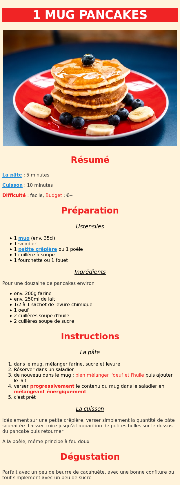

# Recette de pancakes

## Objectif

Réaliser l'intégration de la recette des "1 mug pancakes" :



## Charte

- La font (police de caractères) est sans empâtement : `sans-serif`
- La couleur de fond est `#fff3db`
- Les titres et autres éléments importants utilisent : `#f02425`
- Le titre principal est en blanc
- Ajoutez le visuel `https://images.unsplash.com/photo-1528207776546-365bb710ee93?fit=crop&w=600` à l'intégration : [MDN - img](https://developer.mozilla.org/fr/docs/Web/HTML/Element/Img) ou [htmlreference - img](https://htmlreference.io/element/img/)
- Ajoutez des liens dans la page, par exemple vers une boutique pour une crêpière ou un mug : [MDN - a](https://developer.mozilla.org/fr/docs/Web/HTML/Element/a) ou [htmlreference - a](https://htmlreference.io/element/a/)
- Ajoutez les textes suivants à l'intégration.

```text
Astuce : Vous n'avez pas d'œuf ? Incorporer un peu de banane écrasée dans la préparation.

Astuce : Ajouter un petit bout de beurre à fondre sur la pile de pancakes, un régal.

Astuce : Si vous n'avez pas d'accompagnement en tête, verser un peu de sirop d'érable avant de servir.
```

- Pour styliser les textes correctement et/ou facilement il faudra faire appel à des petites nouveautés : [MDN - class](https://developer.mozilla.org/fr/docs/Web/HTML/Attributs_universels/class)